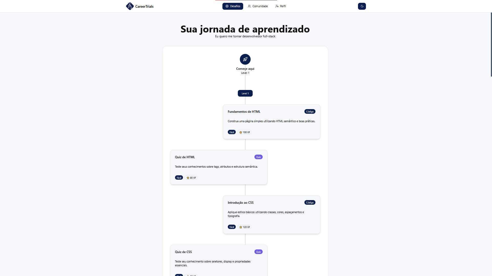

# 🚀 CareerTrials

> Desenvolva sua carreira com IA integrada

CareerTrials é uma plataforma inovadora que conecta desenvolvedores com desafios personalizados, comunidade ativa e mentoria inteligente powered by AI. Acompanhe seu progresso, complete desafios técnicos e evolua sua carreira de forma estruturada.



## ✨ Funcionalidades

- **🎯 Desafios Personalizados**: Receba desafios adaptados ao seu nível e área de atuação
- **🤖 Mentoria com IA**: Chat inteligente que analisa seu perfil e orienta seu desenvolvimento
- **👥 Comunidade Ativa**: Conecte-se com outros desenvolvedores, compartilhe progresso e cresça junto
- **📊 Sistema de Progressão**: Ganhe XP, suba de nível e desbloqueie conquistas
- **🏆 Ranking**: Compare seu progresso com outros desenvolvedores
- **💬 Sistema de Comentários**: Interaja com posts da comunidade
- **🌓 Dark/Light Mode**: Tema claro e escuro totalmente integrado
- **📱 Design Responsivo**: Funciona perfeitamente em desktop, tablet e mobile

## 🛠️ Tecnologias

- **Frontend**: React 19 + Vite
- **Routing**: React Router v7
- **UI Components**: shadcn/ui + Tailwind CSS
- **Icons**: Lucide React
- **Storage**: localStorage (posts, comments, likes)
- **Estilização**: CSS Variables para temas dinâmicos

## 📦 Instalação

### Pré-requisitos

- Node.js 18+ 
- npm ou yarn

### Passos

1. Clone o repositório:
```bash
git clone https://github.com/Solution-Global-Fiap/GlobalSolution2.FrontEnd.CareerTrials.git
cd GlobalSolution2.FrontEnd.CareerTrials
```

2. Instale as dependências:
```bash
npm install
```

3. Instale os componentes shadcn/ui necessários:
```bash
npx shadcn@latest add button input card badge avatar tabs dialog textarea progress
```

4. Inicie o servidor de desenvolvimento:
```bash
npm run dev
```

5. Acesse no navegador:
```
http://localhost:5173
```

## 📁 Estrutura do Projeto

```
careertrials/
├── src/
│   ├── components/
│   │   ├── ui/               # Componentes shadcn/ui
│   │   ├── chat/             # Componentes do chat AI
│   │   ├── community/        # Componentes da comunidade
│   │   ├── AnalysisCard.jsx
│   │   ├── FeatureCard.jsx
│   │   ├── NavBar.jsx
│   │   └── ThemeProvider.jsx
│   ├── pages/
│   │   ├── layouts/
│   │   │   └── MainLayout.jsx
│   │   ├── ChallengesPage.jsx
│   │   ├── CommunityPage.jsx
│   │   ├── LandingPage.jsx
│   │   ├── LoginPage.jsx
│   │   ├── ProfilePage.jsx
│   │   └── NotFoundPage.jsx
│   ├── routes/
│   │   ├── AppRoutes.jsx
│   │   ├── ProtectedRoute.jsx
│   │   └── routes.js
│   ├── data/
│   │   ├── challengesData.js# Dados mockados dos desafios
│   │   ├── posts.js         # Dados mockados dos post
│   │   └── users.js         # Dados mockados dos usuários
│   ├── App.jsx
│   ├── main.jsx
│   └── index.css
├── public/
├── package.json
├── vite.config.js
├── tailwind.config.js
└── README.md
```

## 🎨 Temas

O projeto suporta temas claro e escuro com CSS Variables:

```css
:root {
  --bg: #f5f7fa;
  --text: #111111;
  --primary: #0a1f4e;
  /* ... */
}

.dark {
  --bg: #0b0f19;
  --text: #e2e8f0;
  --primary: #1d4ed8;
  /* ... */
}
```

## 💾 Armazenamento Local

Os dados são persistidos no localStorage:

- `community_posts`: Publicações da comunidade
- `community_comments`: Comentários por post
- `community_likes`: Likes do usuário atual

## 🚧 Roadmap

- [X] Backend API integration
- [ ] Autenticação real (OAuth, JWT)
- [ ] Sistema de desafios funcionais
- [X] Integração com IA real (OpenAI, Claude API)
- [ ] Sistema de notificações

## 📝 Licença

Este projeto está sob a licença MIT. Veja o arquivo [LICENSE](LICENSE) para mais detalhes.

## 👥 Autores

- **Lucas Perez Bonato** - *565356* - [LucasBonato](https://github.com/LucasBonato)
- **Diogo Oliveira Lima** - *562559* - [oliveiralimadiogo](https://github.com/oliveiralimadiogo)
- **Lucas dos Reis Aquino** - *562414* - [LucassAquino](https://github.com/LucassAquino)